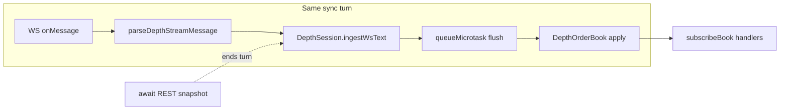

# Binance scalper damru — developer guide (local)

This is the **engineer’s** path: how the repo runs on your machine, what usually breaks, and where to plug in new code. For config field-by-field detail, use [config/README.md](config/README.md). For a map of other in-repo docs, see [DOCUMENTATION.md](DOCUMENTATION.md).

---

## Stack (mental model)

- **Node 20+**, **ESM** (`"type": "module"`), **TypeScript strict** (`strict`, `noUncheckedIndexedAccess`, `exactOptionalPropertyTypes`).
- **Dev entry:** `tsx` loads `src/main.ts` directly (`npm run dev`).
- **Prod-style entry:** `tsc -p tsconfig.build.json` → `node dist/main.js` (`npm run build` / `npm start`).
- **Tests:** Vitest, Node environment, files under `test/**/*.test.ts` (see `vitest.config.ts`).
- **Lint:** ESLint flat config + type-aware rules; **hexagonal import rules** on `src/domain/**` and `src/application/ports/**`.

---

## First-time setup

```bash
git clone <repo-url>
cd binance-scalper-damru
npm install
```

Sanity check (should all be green):

```bash
npm run typecheck && npm run lint && npm test
```

---

## Configuration & environment (the footguns)

1. **No automatic `.env` loading** — `loadConfig()` only reads `process.env`. Either:
   - prefix vars on each command (`TRADING_ENV=testnet CONFIG_PATH=... npm run dev`), or  
   - `export` them in your shell, or  
   - use your IDE run configuration / [direnv](https://direnv.net/) / similar.

2. **`CONFIG_PATH`** must be a **real path** to JSON validated by `src/config/schema.ts`. Start from `config/examples/testnet.json` or `minimal.json`.

3. **`TRADING_ENV` / `APP_ENV`** seeds defaults, then the file merges on top. If the file says `"environment": "live"` but your URLs are still testnet hosts from an earlier merge, **host allowlisting** in `src/infrastructure/binance/constants.ts` will throw — that’s intentional.

4. **Secrets:** `BINANCE_API_KEY` / `BINANCE_API_SECRET` are optional for **read-only** mode after bootstrap; live quoting still requires `features.liveQuotingEnabled` and no `--dry-run`. Never commit keys. Run `npm run verify:secrets` before you push.

5. **`DAMRU_DISABLE_MARKET_DATA=1`** — skips per-symbol Binance WebSocket market data in `MainThreadSymbolRunner` (used by unit tests that mock REST bootstrap only). Omit in real runs so depth + aggTrade drive `SignalEngine`.

Deep merge rules and risk knobs: [config/README.md](config/README.md).

**Trading / ops angle (commands + parameters):** [docs/operator/running-the-trader-and-parameters.md](docs/operator/running-the-trader-and-parameters.md).

---

## Run the app locally

**Hot path (TypeScript, no build):**

```bash
TRADING_ENV=testnet CONFIG_PATH=config/examples/testnet.json npm run dev
```

**Help / argv passthrough:**

```bash
npm run dev -- --help
```

**Keep the process running (dev):** by default the entrypoint exits after bootstrap. Use `npm run dev -- --stay-alive` or `DAMRU_STAY_ALIVE=1` so the process stays up and emits a pulse on `heartbeatIntervalMs` until you press Ctrl+C.

**Compiled run (matches CI / deploy shape):**

```bash
npm run build
TRADING_ENV=testnet CONFIG_PATH=config/examples/testnet.json npm start
```

**What you should see:** startup logs via pino (`config.loaded`, `config.features`, exchange bootstrap, `bootstrap.ready`, `trading.mode.selected`). Startup calls **public REST** (`exchangeInfo`, fee/leverage paths) — allow outbound network or use tests/mocks. Full market-making loop is still phased in; this validates bootstrap, config, and trading mode.

---

## Market data hot path (depth book)

Per-symbol depth flows through **`BinanceBookFeedAdapter`** → **`DepthSession`** → **`DepthOrderBook`**. JSON frames are validated in **`depth-stream-parse.ts`**; REST `/fapi/v1/depth` snapshots go through a process-wide **`DepthSnapshotConcurrencyGate`** (`binance.maxConcurrentDepthSnapshots`, optional `depthSnapshotMinIntervalMs`; tests may use the legacy `sharedDepthSnapshotGate` with max 4 and no spacing). WebSocket reconnect uses exponential backoff; `startSymbol` resolves after the **first** successful REST bootstrap while a background loop keeps the feed alive.



Anything that **`await`s** (bootstrap, resync, timers) ends the synchronous turn: the next WS diff is **not** coalesced with the prior microtask batch (see header comment in `depth-session.ts`).

---

## Tests

**Full suite:**

```bash
npm test
```

**Watch while editing:**

```bash
npm run test:watch
```

**Single file (example):**

```bash
npx vitest run test/unit/config/load-config.test.ts
```

Tests are written to avoid live network calls by default. For a **read-only** public REST check:

```bash
TESTNET_SMOKE=1 CONFIG_PATH=config/examples/testnet.json npm run smoke:exchange-info
```

---

## Repo hygiene scripts

```bash
npm run verify:secrets   # src/ + config/ scan for sketchy literals
npm run verify:rollout   # small-live-style config guard (sets env internally)
```

**Rollout & safety (SPEC-10):** before live API keys, read [docs/rollout/promotion-checklist.md](docs/rollout/promotion-checklist.md) and [docs/rollout/emergency-stop.md](docs/rollout/emergency-stop.md). The feature flag table in [docs/architecture/feature-flags.md](docs/architecture/feature-flags.md) is guarded by `test/unit/docs/feature-flags-doc.test.ts` (must stay aligned with `src/config/schema.ts`).

---

## Where code lives (quick map)

| Area | Role |
|------|------|
| `src/main.ts` | Thin entry; delegates to bootstrap |
| `src/bootstrap/composition.ts` | Manual DI / wiring |
| `src/config/` | Zod schema + `loadConfig()` |
| `src/domain/` | Pure strategy math (no infra imports) |
| `src/application/ports/` | Interfaces only |
| `src/application/services/` | Orchestration (bootstrap, signals, execution, supervisor helpers, etc.) |
| `src/infrastructure/` | Binance adapters, logging, clocks |
| `src/runtime/` | Supervisor, IPC envelopes, worker contracts |
| `scripts/` | Smoke + verify utilities (tsx / node) |

ESLint will yell if `domain` or `ports` import `infrastructure` — don’t fight it; lift interfaces or move logic.

---

## IDE / debugging tips

- Run **dev** with Node inspector: `node --import tsx --inspect src/main.ts` (or your IDE’s “Attach”).
- Breakpoints in **tests** work best when running Vitest from the IDE with the same `CONFIG_PATH` env if a test shells out to `loadConfig()`.
- If `tsc` and Vitest disagree, check **`exactOptionalPropertyTypes`** — optional object keys often need `| undefined` on class fields or conditional spreads.

---

## Before you open a PR

```bash
npm run typecheck && npm run lint && npm test && npm run verify:secrets && npm run build
```

Layering and dependency rules: rely on ESLint messages (see [eslint.config.js](eslint.config.js)) and the “Where code lives” table above.
