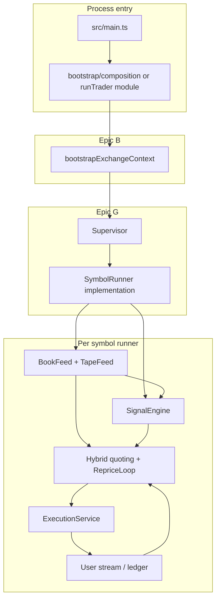

# Remaining implementation plan — runnable scalping bot

This document turns the **epic specs** under `development_document/docs/tasks/epics/` into an **ordered engineering backlog** for everything still missing to run a **continuous** Binance USD‑M micro-scalper: bootstrap → market data → signals → hybrid quotes → **real** REST orders → fills/ledger → supervision → safe shutdown.

**Authoritative per-phase tasks, acceptance criteria, and exhaustive Definition of Done:** [docs/phases/README.md](./phases/README.md) (Phases **01–10** in separate files).

**Technical specifications for implementation:** [docs/specs/README.md](./specs/README.md) (SPEC-01–10 — types, module map, normative algorithms, test matrices).

**Scope assumptions**

- **MVP runnable bot** = testnet-first, one or few symbols, POST_ONLY maker loop with cancel/replace, user-stream fills, basic risk limits, supervisor heartbeat, graceful SIGINT.
- **Full RFC posture** = all epic acceptance gates (H1 markout feedback, H6 regime halts, full metrics, etc.) layered after MVP.

---

## 0. Current state (baseline)

Already in-repo (representative, not exhaustive):

| Area | Status |
|------|--------|
| Epic A | Toolchain, Zod config, load order, examples, verify scripts, structured logging, monotonic time |
| Epic B (modules) | REST client, `exchangeInfo` parse, signed REST, fees, leverage brackets/set leverage, spread gate, `bootstrapExchangeContext` |
| Epic C (modules) | WS client, depth book, agg trades, bounded queue, `BinanceBookFeedAdapter` / tape side, port types |
| Epic D | VPIN buckets, RV helpers, `SignalEngine` (unit-tested) |
| Epic E (modules) | Hybrid quoting domain, `ExecutionService`, signed order helpers, reprice loop pieces, user-stream parser |
| Epic F / H (modules) | Position ledger, margin/loss/markout/reconciliation/rate-limit **classes** and tests |
| Epic G (partial) | `Supervisor`, IPC envelope types, snapshot scheduler, symbol registry — **no** `SymbolRunner` OS implementation; **not** started from `main` |
| Entry | `src/main.ts` loads stub `ExchangePort`, logs config, optional dev keep-alive — **no** `bootstrapExchangeContext`, **no** trading loop |

**Gap:** vertical **integration** and a **process model** that keeps the event loop alive with real I/O and correct shutdown.

---

## 1. Definition of done

### 1.1 MVP — “Runnable scalping bot” (engineering)

1. `npm run dev` (or `npm start`) with valid testnet config + API keys **opens** depth + aggTrade **WS** for at least one accepted symbol after **successful** `bootstrapExchangeContext`.
2. **Tape events** drive **VPIN / toxicity snapshot**; **book** drives **touch spread** + hybrid **QuoteIntent** generation on a bounded timer or book-update policy (per `reprice-loop` design).
3. **Orders**: `ExecutionService.placeFromIntent` issues **POST_ONLY** quotes where policy allows; **cancel/replace** path exercised on reprice.
4. **User data stream** (listenKey) receives fills; **position ledger** updates; **session / notional limits** from config can **block** new risk-adding orders.
5. **Supervisor** owns symbol set: **heartbeat** from worker path (or main-thread runner emitting heartbeats) → **miss threshold** triggers **cancel-all** for that symbol (mock or real).
6. **SIGINT/SIGTERM**: stop WS, cancel open orders (policy), flush logs, exit non-dirty.
7. **CI**: default tests remain offline; optional `TESTNET_SMOKE` unchanged; new integration tests use **fixtures/mocks** for WS/REST where possible.

### 1.2 Full RFC / epic complete (later)

- Worker **process** isolation (`worker_threads` or child process) per symbol, full **IPC** catalog, **60s** portfolio stats per Epic G2, **H1–H6** behaviors wired per epic docs, **Epic I** promotion artifacts and drills.

---

## 2. Architecture target (integration view)

---

## 3. Work phases (ordered)

Each phase ends with **mergeable PRs**, **tests**, and a **manual smoke** note.

### Phase 1 — Async entry and bootstrap on the hot path

**Goal:** `main` becomes async-safe and calls real bootstrap before any “run” decision.

| Task | Detail | Acceptance |
|------|--------|--------------|
| 1.1 | Introduce `runTrader(argv): Promise<void>` (new module under `src/bootstrap/` or `src/runtime/`) invoked from `main`; keep `main()` thin | `main` handles top-level `catch`, sets `exitCode` |
| 1.2 | From loaded `AppConfig`, call `bootstrapExchangeContext(cfg, log)` | Logs per-symbol accept/reject; **zero** accepted symbols → fail fast with clear message |
| 1.3 | Thread `BootstrapExchangeContext` into a factory that will later build runners (not yet WS) | Unit test: mock `fetchExchangeInfo` / fees path returns decisions |

**Dependencies:** Epic A (done).  
**Touches:** `src/main.ts`, new `run-trader.ts` (name flexible), minimal changes to `composition.ts` if config-only context still needed for logging.

---

### Phase 2 — Composition: credentials, REST client, deprecate stub-only path

**Goal:** One place constructs **signed** `BinanceRestClient`, `ExecutionService`, and any “venue” helpers; **no** silent stub if keys present.

| Task | Detail | Acceptance |
|------|--------|--------------|
| 2.1 | Extend composition (or post-bootstrap factory) to build `BinanceRestClient` from `cfg.binance.restBaseUrl` | Matches Epic B1.1 |
| 2.2 | If `cfg.credentials` complete → build `SignedCredentials` + `ExecutionService`; else **read-only** mode (WS public only, no orders) **explicit** in logs | Operator understands mode from startup logs |
| 2.3 | **`ExchangePort` strategy:** either (a) expand `ExchangePort` with `placeMarketMakingOrders` subset, or (b) **narrow** epic wording: execution stays `ExecutionService` + ports for market data only | ESLint/domain boundaries preserved; ADR comment in `exchange-port.ts` |
| 2.4 | Remove or gate `createStubExchangeAdapter` when credentials + “trading enabled” flag exist | Config flag `features.tradingEnabled` or CLI `--dry-run` (recommended) |

**Dependencies:** Phase 1.  
**Epic alignment:** B2, E2 (construction), I1 (env/credentials).

---

### Phase 3 — `SymbolRunner` v0 (main-thread runner)

**Goal:** Prove **full loop** without `worker_threads` complexity first (Epic G1 allows encapsulation behind `SymbolRunnerPort`).

| Task | Detail | Acceptance |
|------|--------|--------------|
| 3.1 | Implement `MainThreadSymbolRunner` in `src/runtime/worker/` (or `symbol-runner-main-thread.ts`) implementing `SymbolRunnerPort` | `start`/`stop` idempotent |
| 3.2 | Runner holds: `SymbolSpec`, `EffectiveFees`, `LoggerPort`, `BinanceRestClient`, `ExecutionService`, `SignalEngine`, adapters for book+tape | Constructor injection / small internal factory |
| 3.3 | `stop()` closes WS, clears timers, **cancelAllOpenOrders** for symbol (if creds) | Mock tests for cleanup order |

**Dependencies:** Phase 2.  
**Epic alignment:** G1.1–G1.3 (bootstrap sequence inside runner), C3.3 lifecycle.

---

### Phase 4 — Market data wiring inside runner

**Goal:** Epic C satisfied for **one symbol** on the hot path.

| Task | Detail | Acceptance |
|------|--------|--------------|
| 4.1 | Instantiate `BinanceBookFeedAdapter` + tape adapter with `cfg.binance.wsBaseUrl`, symbol stream names | Connect + first top-of-book log |
| 4.2 | Wire book updates → staleness + mid for quoting; wire tape → `signalEngine.onTapeEvent` | Unit/integration with recorded fixtures |
| 4.3 | Gap / reset path: on resync, **pause quoting** until fresh (interface to reprice policy) | Log `bookResyncCount` or equivalent event |

**Dependencies:** Phase 3.  
**Epic alignment:** C1–C3.

---

### Phase 5 — Signal → hybrid quote → execution loop

**Goal:** Epic D → E1 → E2 on a **timer** or event-driven cadence.

| Task | Detail | Acceptance |
|------|--------|--------------|
| 5.1 | Build `QuotingInputs` from `SignalEngine` snapshot + book touch spread + inventory mode (start with flat / neutral) | Golden tests for regime matrix (existing domain tests + glue) |
| 5.2 | Integrate `reprice-loop` (or minimal subset): debounce, max replace rate | Config uses existing `heartbeatIntervalMs` or dedicated `repriceMinIntervalMs` if already in schema |
| 5.3 | First **POST_ONLY** place path; **cancel** stale quotes before replace | Testnet dry validation doc in README |
| 5.4 | Feature flag: `features.liveQuotingEnabled` default `false` until operator flips | Safe default on live JSON mistakes |

**Dependencies:** Phase 4.  
**Epic alignment:** D1.6, E1–E2, E4 partial.

---

### Phase 6 — User stream, ledger, reconciliation (minimal)

**Goal:** Positions are not “REST imagination only” (Epic E3 + F1 + H2 skeleton).

| Task | Detail | Acceptance |
|------|--------|--------------|
| 6.1 | `listenKey` create/keepalive/close; connect user WS in runner | Logged lifecycle; renewal timer |
| 6.2 | Parse fill events → `PositionLedger` updates; dedupe trade id | Fixture tests |
| 6.3 | Wire `ReconciliationService` (or thin wrapper) on interval from supervisor or runner | Logs discrepancy → `ReconcileRequired` path |
| 6.4 | Enforce `maxAbsQty` / `maxAbsNotional` before place | Unit tests for block |

**Dependencies:** Phase 5.  
**Epic alignment:** E3, F1, H2.

---

### Phase 7 — Supervisor integration

**Goal:** Epic G: one coordinator, many symbols, heartbeat policy.

| Task | Detail | Acceptance |
|------|--------|--------------|
| 7.1 | After bootstrap, `Supervisor` receives accepted `SymbolSpec[]` + shared deps | Starts N runners |
| 7.2 | Plumb IPC or **in-process** callbacks for MVP (`MetricDelta`, `Heartbeat`) | Miss threshold → **cancel-all** for symbol |
| 7.3 | Snapshot scheduler prints consolidated block (stdout or structured log) | Align with existing `snapshot-scheduler.ts` |
| 7.4 | `HALT_QUOTING` broadcast from config signal or risk trip | Workers stop placing |

**Dependencies:** Phase 6.  
**Epic alignment:** G1.4–G2, F2/H5 hooks.

---

### Phase 8 — OS-level worker isolation

**Goal:** Epic G1 process model — `worker_threads` (preferred first) or `child_process`.

| Task | Detail | Acceptance |
|------|--------|--------------|
| 8.1 | Serialize bootstrap payload + config subset for worker entry | Version field in envelope (existing types + bump if needed) |
| 8.2 | Worker entry file `symbol-worker.ts` runs same loop as Phase 3–6 | Smoke: 2 symbols, 2 workers |
| 8.3 | Supervisor **cancel-all** on worker exit / crash | Test with forced throw |

**Dependencies:** Phase 7.  
**Epic alignment:** G1.1, G1.2, H4.

---

### Phase 9 — Hardening pass (selective P0/P1 from Epic H)

**Goal:** Production-shaped behavior without blocking MVP on every H6 item.

| Priority | Items | Notes |
|----------|--------|--------|
| P0 | H4 graceful shutdown (extend dev-keep-alive vs prod path) | Unified signal handler |
| P0 | H3 rate limit budget on REST hot path | Already have module — wire |
| P1 | H1 markout on fills + optional feedback into E4 | After stable fills |
| P1 | H5 session loss cap / cooldown | Wire to supervisor halt |
| P2 | H6 regime flags / symbol halt | Config-gated |

**Dependencies:** Phase 7+.

---

### Phase 10 — Epic I completion in-repo

**Goal:** Operator-facing gates match epic I.

| Task | Detail |
|------|--------|
| I1.4 | Add `docs/rollout/testnet-limitations.md`; link from README |
| I1.3 | `docs/architecture/feature-flags.md` or section in `config/README.md` listing flags + owners |
| I2 | Promotion checklist markdown + `verify:rollout` cross-links |

---

## 4. Suggested PR sequence (merge order)

1. **PR-1:** Phase 1 — async `runTrader` + bootstrap on path + tests  
2. **PR-2:** Phase 2 — composition + credentials + dry-run flag + `ExchangePort` ADR  
3. **PR-3:** Phase 3–4 — main-thread runner + WS connect + signal feed  
4. **PR-4:** Phase 5 — quoting + execution + reprice + feature flag  
5. **PR-5:** Phase 6 — user stream + ledger + reconciliation interval  
6. **PR-6:** Phase 7 — supervisor + heartbeat + cancel-all  
7. **PR-7:** Phase 8 — worker_threads split  
8. **PR-8:** Phase 9–10 — hardening + rollout docs  

Each PR: `typecheck`, `lint`, `test`, and a **one-paragraph** “How to manually smoke” in PR description.

---

## 5. Testing strategy

| Layer | Approach |
|-------|----------|
| Unit | Keep existing fast tests; add factories for `BootstrapExchangeContext` fakes |
| Integration | Mock `fetch`, mock WS server (or recorded **jsonl** transcripts already under `test/fixtures/`) |
| E2E testnet | Manual checklist: small size, single symbol, **cancel-all** on exit, verify no orphan orders in UI |
| CI | No live network; gate network scripts behind env flags |

---

## 6. Risks and mitigations

| Risk | Mitigation |
|------|------------|
| Big-bang PR | Strict phase order above; main-thread runner before workers |
| Order orphans on crash | Heartbeat + cancel-all; reconciliation loop; startup cancel-all option |
| ExchangePort creep | Keep domain pure; venue logic in `infrastructure/binance`; application orchestration only |
| Testnet ≠ economics | Epic I docs; markout before size-up (H1) |
| Secret leakage | Keep redaction tests; never log query strings with signature |

---

## 7. Traceability matrix (phases → epics)

| Phase | Primary epics |
|-------|----------------|
| 1 | B (bootstrap entry), A |
| 2 | B, E, I |
| 3–4 | C, G |
| 5 | D, E |
| 6 | E, F, H |
| 7 | G, F, H |
| 8 | G, H |
| 9 | H |
| 10 | I |

---

## 8. Maintenance

- Update this file when a **phase completes** (checkbox section can be added per team preference).
- Keep epic source of truth in `development_document/docs/tasks/epics/`; **this file** is the **execution ordering** for the application repo.
